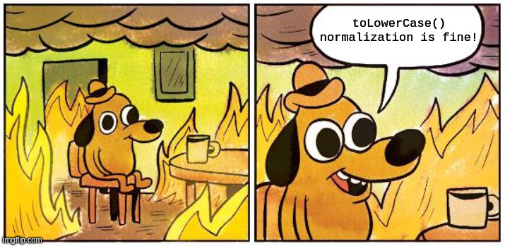
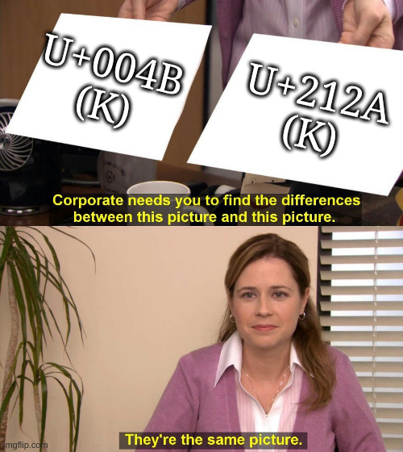
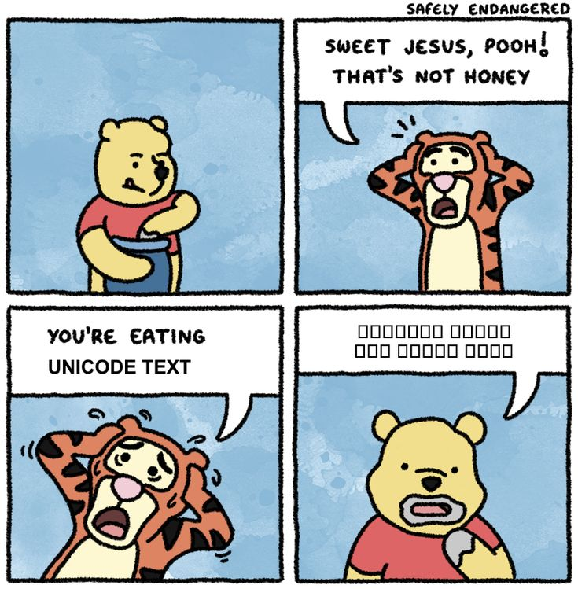

# Attaques Unicode


---


# Qui suis-je?

Alexandre ZANNI a.k.a [noraj](https://pwn.by/)

Pentester [@ACCEIS](https://www.acceis.fr/)

---

# Plan

1. ~~Fonctionnement d'Unicode~~
2. ~~Problématiques liées à Unicode~~
3. ~~Attaques ciblant Unicode~~
4. ~~Détecter et se protéger des attaques Unicode~~
5. C'est une rump (5min)

---

🇺🇸

## Case transformation collision

##### Account takeover via password reset

---

🇫🇷

## Collision par transformation de casse

#### Prise de contrôle du compte par réinitialisation du mot de passe

---


---

`email.toLowerCase()`

`Admin@hackceis.pw` ➡️ `admin@hackceis.pw`



---

`admin@HACKCEIS.pw` vs `admin@HACKCEIS.pw`

---



---

1. U+004B (Latin Capital Letter K)
    - ➡️ U+006B (Latin Small Letter K)
2. U+212A (Kelvin Sign)
    - ➡️ U+006B (Latin Small Letter K)

---

```js
> a = "K";
'K'
> b = "K";
'K'
> a == b
false
> a.toLowerCase() == b.toLowerCase()
true
```

---

- sélectionne `email.toLowerCase()` en DB (legit)
- envoi l'email à `email` (hacker)

---

🇺🇸

## Host splitting

---

🇫🇷

## Fractionnement de l'hôte

---

U+2100 (Account Of)

`℀` (U+2100) ➡️ `a (U+0061) + (U+002F)+ c (U+0063)`

`℀` ➡️ `a/c`

---

```ruby
url = 'https://acceis.c℀hat.client.com'
url.unicode_normalize(:nfkd) # => "https://acceis.ca/chat.client.com"
url.unicode_normalize(:nfkc) # => "https://acceis.ca/chat.client.com"
```

---

https://acceis.c℀hat.client.com

⬇️

https://acceis.ca/chat.client.com

---

https://acceis.medi℀areer.client.com

⬇️

https://acceis.media/career.client.com

---

TLDs : `.ca`, `.media`, `.ninja`, `pizza`, `.mba`, `.moda`, etc.

---

Example : navigateur qui reçoit un en-tête HTTP `Location` et qui renvoie vers sa version normalisée, URL parser

---

Il n'y a pas que `a/c` :

- ⁈ (U+2048) ➡️ `?!`
- ／ (U+FF0F) ➡️ `/` ⬅️ the best
- ＃ (U+FF03) ➡️ `#`
- ＠ (U+FF20) ➡️ `@`
- ： (U+FF1A) ➡️ `:`
- ⒈ (U+2488) ➡️ `1.`

---



---

## Crédits images

- Unicode.png,https://techmonitor.ai/wp-content/uploads/sites/4/2016/07/Unicode.png
- qui-est-ce.jpg,https://www.jedisjeux.net/media/cache/full/uploads/img/qui-est-ce-49-1388486597.jpg
- this_is_fine.jpg,https://imgflip.com/i/6acvwc
- They_are_the_same_picture.jpg,https://imgflip.com/i/6acz1b
- honey.jpg,https://i.pinimg.com/736x/df/71/8f/df718faabe99f1251cef495fff9575ac.jpg
