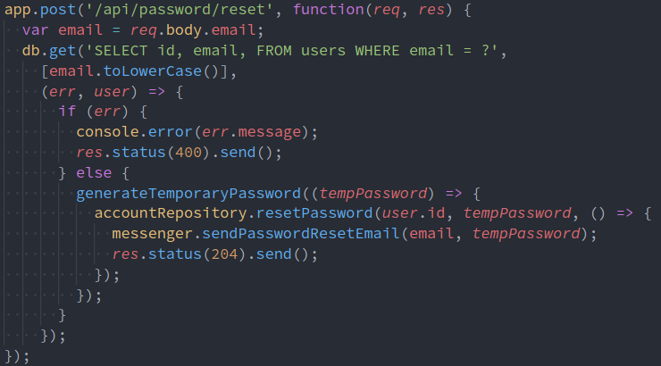

# Attaques Unicode

---

# Qui suis-je?

Alexandre ZANNI a.k.a [noraj](https://pwn.by/)

Pentester [@ACCEIS](https://www.acceis.fr/)

---

# Plan

1. ~~Fonctionnement d'Unicode~~
2. ~~Problématiques liées à Unicode~~
3. ~~Attaques ciblant Unicode~~
4. ~~Détecter et se protéger des attaques Unicode~~
5. C'est une rump (5min)

---

## Case transformation collision

##### Account takeover via password reset

---

---

